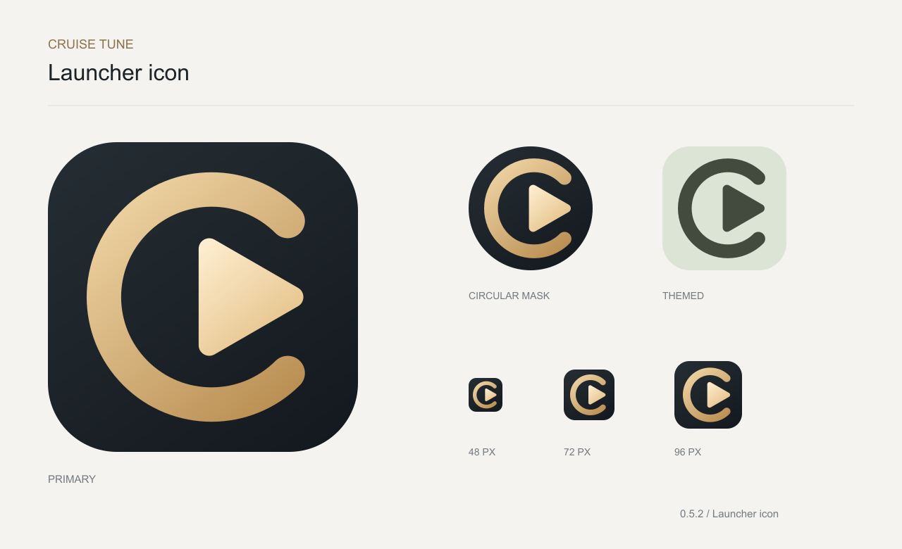

# Cruise Tune

面向安卓车机的原生音乐播放器。通过本地目录或已授权的夸克网盘目录建立曲库，支持边播边缓存、播放位置恢复和大尺寸触摸操作。



## 当前功能

- 本地音乐目录、默认夸克网页扫码登录，以及可选 Token 授权接入。
- 指定目录扫描与可选递归、分页读取、持久化曲库；曲库与队列支持按歌曲名称或目录 / 文件名升降序排列，队列排序保留当前歌曲和进度。
- 来源登记防重复：已添加目录复用曲库，跨登录方式首次确认关联；每个来源旁可直接移除目录，确认后清理本机条目，保留原始音乐文件；支持清除 Token 授权。
- 上一首／下一首、进度调整、顺序／随机／循环播放、媒体会话与音频焦点。
- 播放队列自动跟随当前歌曲；手动浏览不会被进度刷新反复打断，可点击“队列”重新定位当前项。
- 当前歌曲大封面、歌手与专辑信息；优先读取歌曲内嵌歌词，也支持同目录同名 `.lrc`。带时间戳的歌词双行同步显示，纯文本歌词可手动滚动，可随时切回封面。
- 当前歌曲可主动保留离线，区分等待下载、下载中、已保留及需要重试的状态。
- 每 2 秒及关键事件保存播放位置、队列和播放意图；恢复后默认等待用户继续。
- 默认缓存真实播放顺序中的后 3 首完整歌曲，不区分网络类型；临时网络故障持续退避重试。
- Android 系统熄屏或主显示屏关闭时暂停并保存进度，亮屏不自动恢复播放。
- 横竖屏布局、日／夜模式、对比度及减少动态效果选项。

应用版本由 [version.properties](android-app/version.properties) 统一维护。最低 API 23，编译 SDK 36，目标 SDK 35。使用 Kotlin、Android Views、Media3、OkHttp、SQLite 与 Android Keystore，不依赖 Google Play 服务。目标环境为可安装普通 APK 的厂商定制 Android 车机；不假定它一定是标准 Android Automotive OS。

## 构建

需要 JDK 17、Android SDK Platform 36 和 Build Tools 35.0.0；Gradle Wrapper 已包含在仓库中。

```sh
cd android-app
./gradlew :app:assembleDebug :app:testDebugUnitTest :app:lintDebug
```

通过 `ANDROID_HOME` 或本机的 `android-app/local.properties` 指定 Android SDK。`local.properties` 不提交。

输出位于 `android-app/app/build/outputs/apk/debug/app-debug.apk`。这是开发测试包，仓库不包含任何 APK、签名私钥或预置用户账号。不同机器默认生成的 debug 签名可能不同；保留数据的覆盖安装需要相同签名。

## 夸克客户端配置

仓库提供授权协议实现和空配置模板，**不包含客户端签名参数、用户令牌或 Cookie**。直接扫码授权需要构建者在本机准备适用于其使用场景的客户端配置：

```sh
cp android-app/config/quark_cli_client.example.json \
  android-app/app/src/main/assets/quark_cli_client.json
```

在复制后的本地文件填写 `clientId` 与 `signKey`，然后构建。该文件已被 Git 忽略；不要改为跟踪文件，也不要将实际值写进文档。缺少或留空配置时仍可构建并使用本地音乐，直接扫码授权会提示此安装包尚未配置。

客户端配置会进入自行构建的 APK，不能把随包配置视为不可提取的秘密；用户登录后产生的凭证由 Android Keystore 加密保存。协议参考与当前接入边界见 [夸克接入说明](docs/quark-integration.md)。

## 文档与目录

- [更新记录](CHANGELOG.md)
- [环境依据与架构设计](docs/architecture.md)
- [夸克接入与配置](docs/quark-integration.md)
- [测试记录与实车验收边界](android-app/TESTING.md)
- [界面与图标设计](docs/design.md)
- [第三方参考与许可](android-app/THIRD_PARTY_NOTICES.md)
- [提交与脱敏检查](docs/publishing.md)
- [创建版本标签后自动发布 Release](docs/releases.md)
- `android-app/`：应用、资源与自动化测试。
- `tools/`：构建辅助、图标资源生成和本地授权实验脚本。
- `open-service/`：早期连接服务方案，仅作为研发参考；当前应用没有其配置入口。

## 文档与数据处理

仓库中的文档为脱敏后的研发说明。原始授权页面、二维码、设备标识、个人音乐目录、系统日志、模拟器截图、下载的第三方安装包和本机工具链配置均不纳入版本控制。测试中的账号、令牌和文件名使用合成样例。
