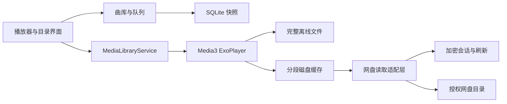

# 环境依据与架构

## 目标与兼容

面向领克 01、LYNK OS N 2.0.0、高通 8155 ARM 等可手动安装 APK 的定制 Android 车机。芯片支持 64 位，不代表厂商系统一定开放 64 位进程；实际 ABI 和 SDK_INT 仍需设备读取。

初期参考 Apple Music 4.6.0（1353）进行 APK 核验：对应样本声明 minSdk 23、targetSdk 33，并包含 ARM 32／64 位原生库。因此项目以 API 23 作为最低兼容基线，而不是推断车机运行 Android 13。原始第三方 APK、照片和本机解析记录未收录到仓库。当前项目实际设置以 [构建文件](../android-app/app/build.gradle.kts) 为准。

系统版本、minSdk、targetSdk 和 compileSdk 含义不同。参考 [Android uses-sdk 说明](https://developer.android.com/guide/topics/manifest/uses-sdk-element) 与 [Android ABI 说明](https://developer.android.com/ndk/guides/abis)。本项目不使用 Apple Music 内容或 MusicKit 作为网盘音源。

## 数据与播放路径

目录扫描与音频传输分离。扫描成功后更新曲库；失败时保留旧列表。稳定文件 ID、版本与大小参与缓存身份，不使用临时签名地址作为永久缓存键。当前播放队列独立于目录索引，保存实际随机顺序。

## 播放快照

播放中每 2 秒以及切歌、跳转、暂停、模式变化等关键事件保存状态。歌曲、位置、队列和播放意图一致提交；数据库使用 SQLite WAL 与 FULL 同步，保留上一份有效快照。不要依赖 onDestroy 或关机广播完成最后一次保存。

打开应用先恢复信息与位置，默认等待用户继续。熄屏时清除播放意图，即使开启自动续播，下一次亮屏也不会自行恢复。进程结束与物理断电不同，不能把模拟器采样差当作最大断电误差保证。依据：[Android 生命周期](https://developer.android.com/guide/components/activities/activity-lifecycle)、[SQLite synchronous](https://www.sqlite.org/pragma.html#pragma_synchronous)、[Media3 后台播放](https://developer.android.com/media/media3/session/background-playback)。

## 缓存与网络

优先完整离线文件，其次磁盘缓存，最后解析网盘地址读取缺失字节。完整离线任务与可淘汰的流式缓存分开管理。

自动缓存默认开启，目标为真实播放顺序中的后 3 首完整歌曲，不按网络类型限制。当前曲目缓冲充足后启动串行预缓存；模式或当前曲目变化时重新选目标。临时网络失败按 2、4、8、15、30 秒退避，此后维持 30 秒，无重试次数上限；单首失败不阻塞其他目标。暂停或关闭自动缓存会停止任务。

永久授权、文件不存在、无效分段、证书和存储错误单独处理。缓存仍受容量和剩余空间限制，默认流式容量为 2 GiB。“已缓存部分”不等于整首离线可播；文件头、索引和目标区间也必须可用。

分段读取校验 HTTP 206、Content-Range 与实际长度。临时地址刷新后保持原偏移；文件版本变化时不混用旧片段。参考 [HTTP Range](https://www.rfc-editor.org/rfc/rfc9110.html#name-range-requests)、[Media3 网络层](https://developer.android.com/media/media3/exoplayer/network-stacks)。

## 接入范围

当前实现夸克与本地目录。阿里云盘、百度网盘保留为后续来源，不能因存在第三方驱动就宣称已接入。各来源分别验证用户授权、目录边界、原文件下载、分段读取、刷新和弱网恢复，再接入统一播放路径。
