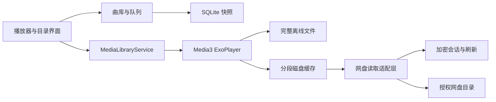

# 环境依据与架构

## 目标与兼容

面向高通 8155 ARM 等可手动安装 APK 的定制 Android 车机。芯片支持 64 位，不代表厂商系统一定开放 64 位进程；实际 ABI 和 SDK_INT 仍需设备读取。

初期参考 Apple Music 4.6.0（1353）进行 APK 核验：对应样本声明 minSdk 23、targetSdk 33，并包含 ARM 32／64 位原生库。因此项目以 API 23 作为最低兼容基线，而不是推断车机运行 Android 13。原始第三方 APK、照片和本机解析记录未收录到仓库。当前项目实际设置以 [构建文件](../android-app/app/build.gradle.kts) 为准。

系统版本、minSdk、targetSdk 和 compileSdk 含义不同。参考 [Android uses-sdk 说明](https://developer.android.com/guide/topics/manifest/uses-sdk-element) 与 [Android ABI 说明](https://developer.android.com/ndk/guides/abis)。本项目不使用 Apple Music 内容或 MusicKit 作为网盘音源。

## 数据与播放路径

目录扫描与音频传输分离。扫描成功后更新曲库；失败时保留旧列表。稳定文件 ID、版本与大小参与缓存身份，不使用临时签名地址作为永久缓存键。当前播放队列独立于目录索引，保存实际随机顺序。

## 音频解码

FLAC 默认通过官方 Media3 扩展和 libFLAC 1.5.0 解码成 PCM，再交给 AudioSink 输出；缓存保存原始压缩字节。原生模块包含 ARM 32／64 位，构建与来源见 [FLAC 模块说明](../android-app/decoder-flac/README.md)。

## 播放快照

播放中每 2 秒以及切歌、跳转、暂停、模式变化等关键事件保存状态。歌曲、位置、队列和播放意图一致提交；数据库使用 SQLite WAL 与 FULL 同步，保留上一份有效快照。不要依赖 onDestroy 或关机广播完成最后一次保存。

打开应用先恢复信息与位置，默认等待用户继续。熄屏时清除播放意图，即使开启自动续播，下一次亮屏也不会自行恢复。进程结束与物理断电不同，不能把模拟器采样差当作最大断电误差保证。依据：[Android 生命周期](https://developer.android.com/guide/components/activities/activity-lifecycle)、[SQLite synchronous](https://www.sqlite.org/pragma.html#pragma_synchronous)、[Media3 后台播放](https://developer.android.com/media/media3/session/background-playback)。

## 数据保留与清理

播放快照固定保留最新和上一份两条记录；队列只保留快照引用的版本。位置更新使备用快照转向同一队列后，旧队列会及时清除，不再等下一次换队列。

完成目录扫描及加载曲库时，分批清理 `present=0` 且无引用的歌曲。当前／备用队列、离线下载请求及仍在界面显示的曲目暂时保留；刷新窗口中的上一份界面数据会在后续维护时释放。离线引用读取失败时先保留数据，之后成功读取再清理。失败的扫描仍会回滚，不把临时网络失败当成空目录。

清理按 256 条候选 ID 分批处理，避免大规模历史数据占满内存或超过 SQL 参数数目限制。旧数据库不需要重建，也不删除账号、播放快照或音频缓存。SQLite 已释放的数据页供以后复用，数据库主文件不保证立刻缩小；不在播放过程中自动执行整库 VACUUM。

写连接显式设置每 256 页自动 checkpoint，以及 WAL 重置后保留 1 MiB 的目标；写入提交之后最多每分钟额外尝试一次 PASSIVE checkpoint。它不会等待读写事务结束，也不会手动删除日志文件。FULL 同步保持不变。活跃长事务或大批量写入期间日志仍可能超过该目标，因此这不是运行中 WAL 的绝对硬上限。依据：[SQLite checkpoint 与 journal_size_limit](https://www.sqlite.org/pragma.html#pragma_journal_size_limit)。

## 缓存与网络

优先完整离线文件，其次磁盘缓存，最后解析网盘地址读取缺失字节。完整离线任务与可淘汰的流式缓存分开管理。

自动缓存默认开启，目标为真实播放顺序中的后 3 首完整歌曲，不按网络类型限制。当前曲目缓冲充足后启动串行预缓存；模式或当前曲目变化时重新选目标。临时网络失败按 2、4、8、15、30 秒退避，此后维持 30 秒，无重试次数上限；单首失败不阻塞其他目标。暂停或关闭自动缓存会停止任务。

永久授权、文件不存在、无效分段、证书和存储错误单独处理。缓存仍受容量和剩余空间限制，默认流式容量为 2 GiB。“已缓存部分”不等于整首离线可播；文件头、索引和目标区间也必须可用。

分段读取校验 HTTP 206、Content-Range 与实际长度。临时地址刷新后保持原偏移；文件版本变化时不混用旧片段。参考 [HTTP Range](https://www.rfc-editor.org/rfc/rfc9110.html#name-range-requests)、[Media3 网络层](https://developer.android.com/media/media3/exoplayer/network-stacks)。

完整缓存按匹配文件版本的可信总长度结束读取，避免缓存长度元数据缺失时额外请求网盘来判断 EOF；长度未知、存在缺口或显式旁路时保留正常读取路径。流式缓存预算计入已有占用与可新增空间，磁盘预留限制新写入，不能在重启时重复扣除已存字节。触及预留空间后停止可选缓存写入，继续传递播放数据；空间释放后可以恢复缓存。

## 播放错误与恢复

网盘终止错误可能使播放器进入 IDLE；此时切歌只执行 seek 会更新曲目信息，却不会启动读取。播放服务在手动跳转完成后为选中项重新 prepare，同时保留暂停意图和熄屏限制。目录刷新只更新曲库，不承担播放恢复。

读过流式缓存的歌曲出现明确文件错误，或完整缓存约 10 秒没有实际位置进展时，最多自动旁路重读一次。READY／BUFFERING 状态切换不重置停滞期限。暂停、音频焦点受限、熄屏和未完整的网络缓冲不积累该期限。

只有实际位置前进且新副本完整后才替换该曲目的流式缓存；不自动删除主动保留的离线文件。后台重建独立退避重试，播放恢复后允许后 3 首继续预缓存，并排除正在修复的缓存 key。用户暂停、切歌或熄屏会取消旧恢复任务。

旁路读取中的临时网络错误继续等待重试，保留曲目、位置和队列。再次发生明确文件错误才跳到下一首，一轮队列均失败后停止；网络等待超时、登录失效、权限及未知错误不消耗坏歌预算。缓存字节覆盖完整不等于音频可解码，相关回归方法见 [测试指南](../android-app/TESTING.md#播放与缓存回归要点)。

夸克网页下载接口两次成功返回空文件列表时，才将队列中的该文件判为云端失效并按实际播放顺序跳过；首次空结果会重新确认。已获取的下载链接返回 404 时先重新解析文件标识和地址一次。无论下载链接还是下载接口本身返回 404，仅凭状态码都不作为删除证据。已完整缓存的歌曲仍优先从本地播放。失效项保留在原队列并标记，重新从曲库建立队列后清除标记；网络、登录、权限及未确认错误不会自动跳歌。

## 接入范围

当前实现夸克与本地目录。阿里云盘、百度网盘保留为后续来源，不能因存在第三方驱动就宣称已接入。各来源分别验证用户授权、目录边界、原文件下载、分段读取、刷新和弱网恢复，再接入统一播放路径。
