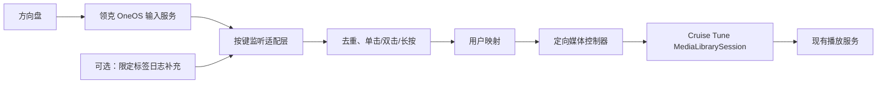

# 小八智控大师 1.6.3：方向盘按键映射分析

## 结论

已从用户下载的原 APK 中通过 GDB 取得运行时 DEX，恢复出主要按键接收、动作识别、映射和媒体控制代码。主入口是**吉利 OneOS 服务的 Binder 回调**，部分按键另有**系统日志补充采集**；它将事件去重、识别单击／双击／长按后，按配置执行标准媒体键、打开应用等动作。

本次没有修改授权检查、伪造车辆信息或向真实车辆发送命令。BlueStacks 不含目标 OneOS 服务，不能将代码分析当作方向盘实车验证。

## 样本与方法

| 项目 | 实际结果 |
| --- | --- |
| 文件 | `【强烈推荐】小八智控大师_v1.6.3_0402更新_最新稳定版.apk`；用户下载的两份文件一致 |
| 官网入口 | 小八官网“智控大师”下载入口，指向 `https://share.feijipan.com/s/Sm2rkIOS`；最终使用用户下载的文件 |
| 包名 | `com.xiaoba.smartcontroller` |
| 版本 | `1.6.3` / versionCode `33` |
| 大小 | 8,359,808 字节 |
| SHA-256 | `9ace0d266b737fcde0696850924b3287523f41daa6c8b9f1e491239abcb30570` |
| 签名证书 SHA-256 | `93c22deb79d632357a7724d3a8e1a18e9acdcedd710bb848bc021aefb23cdef6`；签名校验通过 |
| min / target SDK | `24 / 34` |
| 加固 | StubApp、libjiagu；另有 `libsmartcontroller.so` |
| 分析环境 | BlueStacks / Android 13 / arm64-v8a，1920 × 1080 px、320 dpi；GNU GDB 16.3、JADX 1.5.6 |

静态 JADX 仅得到壳和资源。首次 GDB 附加因进程提前退出失败；过早暂停附加时也未取到业务 DEX。最终预先启动 GDB，目标进程出现后等待约 650ms 再附加，在主动终止调用处导出结构合法的 DEX 容器。

取得 6 个容器，主要可读业务样本 `73f14b12e2775f22.dex` 为 9,163,916 字节、5,454 个类。另一个同尺寸内存副本内容不同，不能仅因尺寸相同就认定已经解密。主要样本的 JADX 输出有 32 项错误；部分复杂函数出现重复分支和类型推断问题，因此以下以明确的类名、IPC 字段、简单控制流程及方法调用为证据，不保证反编译文本可直接编译，也不据此推断所有默认配置的最终状态。

APK、运行日志、DEX 和反编译代码仅留在被忽略的 `outputs/xiaoba-master/` 中，不作为公开源码提交。

## 1. 主接收入口：OneOS Binder

证据：`core/XiaoBaKeyInputManager.java`。

通过 `Context.bindService(..., BIND_AUTO_CREATE)` 连接：

```text
package: com.geely.service.oneosapi
class:   com.geely.service.oneosapi.OneOSApiService
```

随后获取输入管理 Binder，涉及的接口描述符为：

```text
com.geely.lib.oneosapi.IServiceManager
com.geely.lib.oneosapi.input.IInputManager
com.geely.lib.oneosapi.input.IInputListener
```

`registerKeyListener(listener, tag, keyCodes)` 构造自己的 Binder 监听对象，将监听 Binder、标记字符串和键码数组写入 Parcel，再向选定输入服务发起注册事务。服务使用标记 `XiaoBaSteeringWheelService`。

### 回调格式

下表是**该 APK 实现的客户端解析格式**，不是已验证适用于所有 OSN 固件的厂商文档：

| 回调事务号 | 客户端方法 | 读取字段 |
| --- | --- | --- |
| 1 | `onKeyCodeEvent` | 三个 int |
| 2 | `onShortClick` | 两个 int |
| 3 | `onHoldingPressStarted` | 两个 int |
| 4 | `onHoldingPressStopped` | 两个 int |
| 5 | `onLongPressTriggered` | 两个 int |
| 6 | `onDoubleClick` | 两个 int |

监听桥 `i1/m.java` 将短按交给 `SteeringWheelService.q(keyCode, "native")`，长按开始／结束交给 `m()`／`n()`，长按触发交给 `o()`。原始 `onKeyCodeEvent` 在该桥中主要记录信息，不能把它和映射执行入口混为一谈。

### 源键码与标准媒体键

| 样本中的方向盘键码 | `KeyCodes` 定义含义 | 可配置的标准媒体目标 |
| --- | --- | --- |
| `200085` | 方向盘播放／暂停 | `85`：播放／暂停 |
| `200087` | 方向盘右键 | `87`：下一首 |
| `200088` | 方向盘左键 | `88`：上一首 |

样本另列出语音、静音、多功能、全屏地图、触摸滑动等键码。这里给出含义与可配置对应关系，**不等于保证原包当前默认映射就是这三项**；配置迁移、启用状态与目标类型也会影响执行。不同固件仍要通过实际回调或学习模式确认键码。

## 2. 日志补充入口

证据：`SteeringWheelService.onCreate()`、`r()`、`v()` 和 `i1/d.java`。

仅在已有 `READ_LOGS` 权限时，服务创建后台线程执行如下限定日志流：

```text
/system/bin/logcat -T 1 -v brief InputServiceLog-KeyCodeActionImpl:I *:S
```

解析的片段形如：

```text
onShortClick--keyCode->119---softKeyFunction---2
```

同一解析器还识别长按开始、长按触发、长按结束及双击字样，转入相同服务方法；来源标记为 `logcat`。进程退出或读取失败后，在线程仍启用时等待约 1 秒重新启动日志读取。

当前硬编码补充表包括：119 对应 softKeyFunction 2，以及 300050、200164、300001、300002 对应 softKeyFunction 0。**这不是覆盖全部方向盘键的通用日志解析器**；左／右切歌键不在这张补充表中。

`READ_LOGS` 不可用时跳过这条补充路径，仍创建 OneOS 按键管理器。Android 通知展示权限和系统日志读取权限是不同能力。

## 3. 单击、双击、长按与去重

证据：`SteeringWheelService.q()`、`m()`、`n()`、`o()`、`p()` 及延迟任务 `i1/e`。

| 处理 | 样本策略 |
| --- | --- |
| 单击／双击 | 首次短按暂存，延迟 350ms；窗口内再收到同键短按，取消待执行单击并分发 DOUBLE_CLICK |
| 厂商双击回调 | 样本主动忽略，双击由短按组合；这不代表所有方向盘硬件都不提供原生双击 |
| 相同来源重复短按 | 同键 80ms 内忽略 |
| Binder 与日志双来源重复 | 同键 120ms 内忽略 |
| 长按 | 分离 HOLD_START、LONG_PRESS、HOLD_END；长按期间使用集合防止重复触发 |
| 长按结束后的短按 | 300ms 内抑制，避免松手再误触发单击 |
| 已处理事件后的短按防抖 | 另有 200ms 窗口；与先处理的双击待执行分支共同作用 |
| 学习模式 | 将捕获键交给 KeyLearningActivity 选择功能，避免把学习过程直接当作普通执行 |

350ms 是样本自己的选择，并非 Android 强制值。移植思路时应测试快速连按、长按松手和双来源先后顺序，不能只复制常量。

## 4. 映射如何保存和执行

证据：`model/KeyMapping.java`、`core/KeyMappingManager.java`。

映射包含来源键码／名称、目标键码／名称、动作类型、启用状态、目标类型、应用包名等字段。内部索引为：

```text
sourceKeyCode + "_" + actionType.name()
```

配置以 JSON 保存到私有 SharedPreferences `xiaoba_key_mappings` 的 `key_mappings` 项。`executeMapping()` 先取配置并检查启用状态，再按目标类型执行；HOLD_START / HOLD_END 会关联 LONG_PRESS 配置。目标类型包括键码、打开应用、语音助手、小八地图音乐页等。

对于 KEY_CODE 目标，单击发送一次按下／抬起，连续动作的长按开始发送 DOWN、结束发送 UP。映射模块还为媒体动作设置了约 120ms 的重复执行限制。

样本存在默认映射补充、旧配置迁移和核心映射特殊处理。复杂反编译分支未做配置级运行验证，不能将某个默认模板的文字等同于实际最终执行配置。

## 5. 如何控制音乐

键码执行路径首先尝试 `XiaoBaKeyInputManager.sendKeyEvent(keyCode, action)` 交给 OneOS。失败或不可用时，转入媒体控制替代路径。

标准媒体动作的可见实现：

1. `MediaInfoManager` 监听媒体会话变化，维护选定的 `activeController`。
2. `dispatchToActiveTransportControls(85)` 根据该会话状态调用播放或暂停。
3. `dispatchToActiveTransportControls(87/88)` 调用 `skipToNext()` / `skipToPrevious()`。
4. 没有可用控制器时，部分分支使用 `AudioManager.dispatchMediaKeyEvent()`；语音指令另有 MEDIA_BUTTON 广播回退，不能把所有分支说成相同顺序。

会话选择包含正在播放的原厂／白名单应用优先等策略。它不是所有场景都固定控制某个包名，因此直接使用原包不能保证按键始终送给 Cruise Tune。

### 通知访问与媒体按钮接收器

枚举活动会话使用其 `NotificationListenerService`。通知访问未启用时无法正常取得其他应用的会话，样本有异常处理和提示。为获得这些媒体会话而启用通知访问，与普通 `POST_NOTIFICATIONS` 权限不同。

清单还声明了高优先级 `MediaButtonReceiver`。但恢复出的 `handleKeyEvent()` 主要记录事件并通知自身界面，**没有看到它直接进入 KeyMappingManager 执行映射**，不能将这个接收器当成已确认的完整方控备用方案。

## 6. 原厂音源与通话处理

普通短按路径会检查原厂／白名单音源以及当前控制器状态，尽量避免系统已处理的按键又执行一次。样本将控制器值 2 解释为媒体、3 解释为电话，默认严格检查；它通过输入服务事务查询，失败时有电话状态等降级判断。

2026-09-15 补充：用户确认领克原车方向盘有菜单切换，同一组键随菜单改变功能，媒体菜单才控制原厂 QQ 音乐。进一步核对 `SteeringWheelService.java`：

- `l()`（约 620～685 行）日志将查询称为 `getControlIndex`，实际向输入 Binder 发事务 5，返回整数；结果短时间缓存。
- `t()`（约 1191～1220 行）读取 `strict_controller_check`，默认 true；严格模式只允许 2，电话 3 始终禁用。
- 输入 Binder 缺失时直接返回 2；查询失败可走电话状态逻辑并最终默认 2。这种失败时放行不能作为 Cruise Tune 的可靠菜单判断。
- 普通短按在约 1059、1099、1115 行检查菜单；不能由这几处检查推断所有双击／长按分支同样受保护。

因此，菜单上下文需要独立于播放器音频焦点判断。Cruise Tune 的方案改为 SDK 具名 `getControlIndex()`、只在媒体值 2 下执行、未知关闭、接收及动作提交前复查，所有手势统一门控。返回值 2／3 的真实语义、仪表其他菜单值，以及原厂媒体中心是否同时响应，仍待实车验证。

双击与长按走不同分支，不应将普通短按的条件扩大为“所有映射都经过同一通话保护”。我们的实现应把需要遵守的通话／焦点／熄屏策略明确放在最终动作执行端。

## 7. 哪些实现不能直接照搬

### Binder 事务探测并非稳定接口契约

样本在获取输入服务时枚举多个主服务事务号和服务 ID；有的分支只要返回的 Binder 描述符不等于主服务接口就接受。发送键的实现也尝试多个事务号。

注册监听与发送键的代码都曾尝试事务号 3，但写入的 Parcel 格式不同。这只能证明该程序包含这些尝试，不能把它们同时当成正确、通用的 OneOS AIDL 定义。不能在实车盲目扫描事务号；应先取得该固件准确的接口描述或对已知调用做只读跟踪。

### 注销与结果核验

该包装类的 `unregisterKeyListener()` 主要清除本地引用，未在此方法看到对应的远端注销事务。它返回“注册成功”或“发键成功”也不等于已验证播放器执行结果。后续独立实现需要处理远端解绑、Binder 断开、重复注册和实际媒体状态核验。

### 权限仍取决于车机端

主接收路径使用 bindService / Binder；客户端代码没有揭示 OneOS 服务端对 UID、签名或白名单的完整校验。样本声明的 `ecarx.car.permission.CAR_INFO`、`VENDOR_EXTENSION` 也不能单凭声明就证明已获授权或一定是按键接口的权限要求。

本轮使用 root 是为了本机调试和 DEX 获取，不说明最终方控功能必然需要 root，也不说明任意 APK 都能注册同样的服务。

## 8. 对 Cruise Tune 的可借鉴方案



Cruise Tune 已有 MediaLibrarySession，最值得借鉴的是“按键接收 → 去重 → 动作识别 → 定向控制”的前半段。后续应使用独立编写的适配层，明确选中 `com.cruisetune.player`，复用已有播放、缓存、重试、音频焦点和熄屏处理；不依赖“当前全局会话恰好是 Cruise Tune”。

LynkAppManager 可以提供设备能力和权限状态诊断，保留其现有公共 API／受限 ADB 约束。是否增加厂商输入适配，应单独决定，不把第三方加固库、业务源码或任意 Binder 事务扫描移入项目。

## 9. 本次实际验证与未验证项

已完成：原包元数据及签名校验、BlueStacks 安装、GDB 附加、运行时 DEX 导出、按键客户端及映射／媒体方法核对。当前模拟器未安装 `com.geely.service.oneosapi`，不能验证该服务绑定、实体方向盘回调或原车音源路由。

未完成：实车按键编号和附加参数确认、服务端权限验证、真实短／双／长按行为、媒体命令最终送达 Cruise Tune、通话与导航场景。此次没有改写授权结果、映射配置或播放器代码；原包仍未在模拟器稳定运行。

GDB 已正常 detach，智控大师停止运行；本任务临时 GDB／依赖／设备端 DEX 导出目录已清理并确认不存在。原始下载文件、既有播放器账号和系统显示设置保留。
