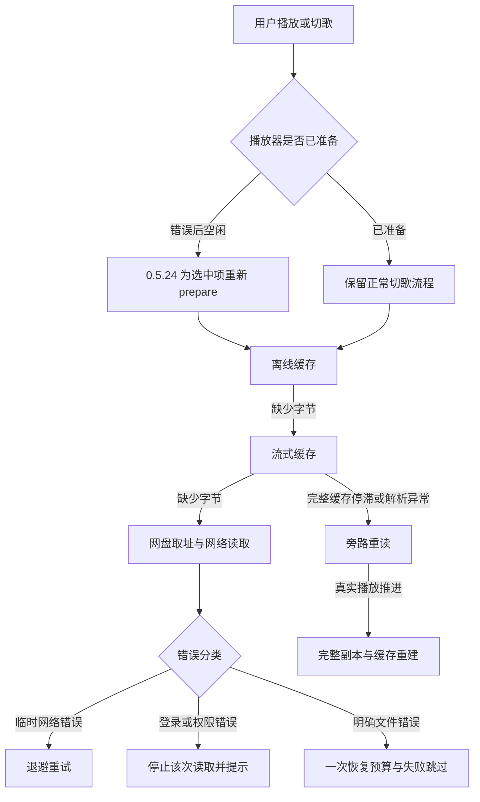

# 播放控制、缓存与重试逻辑深度审查

日期：2026-09-15。

基线：上游 0.5.23（f4c7055）加当前工作区 0.5.24 的报错后切歌修复。该修复版已通过 259 项主机测试、Release Lint 与签名构建；本轮继续审查其余逻辑，不把已有测试通过等同于所有边界正确。

**审查阶段确认了四项待修问题；后续已在 0.5.25 修复，完成情况见第 8 节。下文保留审查时的证据与判断。**

## 1. 审查发现（后续已在 0.5.25 修复）

### R1 · P1：缓存重建失败后卡在恢复状态，后续预缓存也被阻断

位置：[PlaybackService.kt](../../android-app/app/src/main/java/com/cruisetune/player/playback/PlaybackService.kt#L328)，尤其是 `checkRecoveryProgress()` 的失败分支及 `maybePrefetch()` 的入口条件。

触发顺序：旁路重读已经恢复播放 → 开始后台下载完整副本 → 副本下载遇到临时网络错误或存储错误。

开始重建时设置 `attempt.rebuilding=true`。失败后只更新“缓存修复未完成”提示，保留 `recovery`、旁路标记和 rebuilding 状态，没有安排重试。以后进度检查因 rebuilding 为 true 直接返回；后 3 首调度又因 recovery 非空直接返回。当前歌曲可以继续走网络，但缓存修复与后续预缓存均不会自行恢复，直到切换、暂停等操作清理状态。同一首歌循环时，曲目 ID 不变也未必能退出这一状态。

**复现：**控制服务处于已经恢复播放的状态，让缓存重建上游抛出一次 SocketTimeout。模拟 90 秒后仍只有一次请求、recovery 保留、重建任务已经结束，要求存在后续重试或退出恢复的断言失败。使用合成上游和受控播放器状态，不是实车音频复现。

**修复方向：**分离“旁路播放”和“后台缓存修复”的生命周期。修复的临时网络错误需要可取消的退避重试；不可重试或资源不足时结束修复任务，并明确恢复后 3 首的正常调度。不能用一个长期非空的 recovery 同时锁住所有下载。

### R2 · P1：旧网页请求的迟到响应可以覆盖新登录凭证

位置：[QuarkApi.kt](../../android-app/app/src/main/java/com/cruisetune/player/data/QuarkApi.kt#L116)；相关入口为 `LibraryRepository.connectWebSession()` 和播放／下载的 `readRequest()`。

请求发出时使用旧 Cookie，响应返回时却重新读取当前 Cookie，再直接合并 Set-Cookie 并写回。若期间完成重新扫码登录，新 Cookie 已提交，旧响应仍能把旧会话字段覆盖回去。目录扫描与重连使用 scanLock，但播放取址、离线请求没有共同的凭证代次约束，不能靠这个锁排除并发。

**复现：**本地 MockWebServer 收到携带旧会话的请求后等待；测试先保存新登录 Cookie，再释放旧响应的 Set-Cookie。最终新会话字段被旧响应字段替换，保护新登录的断言失败。所有凭证字符串均为合成值。

**修复方向：**按账号维护凭证代次；发请求时捕获代次，响应提交时检查代次未变化，并以串行／比较交换方式合并。重新登录、断开账号及普通 Cookie 轮换都应遵守同一提交规则；旧请求不能写回新会话。Token 路线已有代次与刷新保护，网页登录需要同等级保护。

**边界：**这是可复现的并发缺陷，但没有现场日志证明它就是本次实车最初“夸克连不上”的原因。

### R3 · P2：“完整缓存”的长度判断与实际读取终止条件不一致

位置：[MediaCache.kt](../../android-app/app/src/main/java/com/cruisetune/player/playback/MediaCache.kt#L114)、[PlaybackDataSource.kt](../../android-app/app/src/main/java/com/cruisetune/player/playback/PlaybackDataSource.kt#L18)。

界面用 Track.size 和连续缓存覆盖判断完整；实际播放请求通常没有指定总读取长度，依赖 Media3 的缓存总长度元数据。如果所有字节已在缓存，但总长度元数据未记录，读取器读完最后一个缓存分片后仍可能向网盘请求下一段，无法在已知文件结尾直接返回 EOF。

**复现：**用固定长度请求写入 8,192 字节完整缓存，该写入方式未记录总长度。界面返回“已缓存完整”，并成功读出全部字节，但随后为了判断 EOF 又调用一次失败的网络上游。要求完整缓存独立读取结束的断言失败。

**修复方向：**让可信且版本匹配的文件总长度进入实际读取边界，或在安全条件下补齐缓存长度元数据；按已知文件结尾返回 EOF。需要覆盖从头、尾部、跳转、缺口、总长未知、版本变化和空文件，不能只把 UI 标签改成完整。

**边界：**这是固定长度／缺失总长元数据条件下的读取缺陷；不能据此声称正常 CacheWriter 全文件缓存必然缺少元数据，也不能认定车机现场一定命中了此分支。

### R4 · P2：启动时的缓存容量只扣空闲空间，可能误淘汰已有缓存

位置：[MediaCache.kt](../../android-app/app/src/main/java/com/cruisetune/player/playback/MediaCache.kt#L34)。

streamLimitBytes 在单例初始化时计算为“配置上限”和“当前剩余空闲空间减预留”中的较小者。这里没有计入已经占用磁盘的流式缓存。空间偏紧时，即使空闲空间仍高于预留、已有缓存远低于 2 GiB，重启后也会把 LRU 上限缩小并删除本来可以保留的缓存。

该上限同时是固定 val：若启动时被算为 0，之后释放磁盘空间，hasRoom 会恢复为 true，但容量与淘汰器仍保持 0，缓存不能在当前进程内恢复。

**复现：**先保存 32 KiB 完整缓存并关闭缓存实例；模拟重启时仍有“预留空间＋8 KiB”的空闲空间。新实例上限变成 8 KiB，并淘汰原文件；此时 hasRoom 仍为 true。保留已有合理缓存的断言失败。磁盘空间由 ShadowStatFs 模拟，缓存文件及 SimpleCache 为实际测试对象。

**修复方向：**区分已有缓存占用、还能新增的空间和总预算；初始化预算需把当前缓存占用纳入计算，并在空间变化后更新预算或安全重建淘汰器。预留空间应限制新增写入，不应反复把已经存下的字节再扣一遍。

## 2. 已修复问题：报错后连续切到完整缓存歌曲仍不播放

此前终止错误令 ExoPlayer 进入 IDLE；上一首／下一首仅 seek，元数据和缓存标签更新，但 loader 未重新准备。曲库点歌有 prepare/play，解释了“刷新后再点曲库才恢复”的现象。

0.5.24 已在服务层记录手动跳转并在回调完成后重新 prepare，保留暂停和熄屏行为。原始 8 个实例中，修复前 6 个切歌实例失败、2 个直接缓存播放对照通过；修复后全部通过。扩展为 API 28／33 共 16 个实例，覆盖连续三首、离线层、重新登录错误、上一首、快速连点、暂停、熄屏和未开始队列。完整缓存歌曲本身没有上游请求。

详见 [专项定位记录](../diagnostics/cached-track-after-error.md)。本次深度审查没有撤回该修复。

## 3. 当前状态路径

控制状态与缓存字节是两套条件：磁盘中有字节不代表播放器已经启动；显示完整也不等于音频本身可解码。R3 进一步表明，完整覆盖判断还必须与实际 EOF 边界一致。

## 4. 重试策略对照

| 场景 | 当前策略 | 审查结果 |
| --- | --- | --- |
| 普通播放临时网络错误 | 2/4/8/15/30 秒退避，之后维持 30 秒，无次数截止 | 已有回归通过；应保留 |
| 旁路重读的网络错误 | 同一加载策略；直接终止回调另有可取消的延迟重载 | 原网络保护及取消测试通过 |
| 后 3 首预缓存 | 实际播放顺序、独立错误计数、每项退避；明确错误进入本轮 blocked 集合 | 顺序、去重、队列变更取消、失败后不饿死其他项目已有回归；凭证更新后的 blocked 状态恢复仍需补集成验证 |
| 缓存完整副本重建 | 失败后只提示，未继续重试 | R1，必须修复 |
| 用户“保留离线” | DownloadManager 配置 minRetryCount=2，可进入 FAILED；界面提供手动重试 | 与自动预缓存不同，需要明确产品策略；不把“持续重试”宣传为所有下载任务都一致 |
| 媒体地址 401/403 | 同一偏移与长度重新取址，最多两次；Token 路线可刷新代次 | 已有范围保持与拒绝持续重试回归；网页登录的迟到写回另见 R2 |
| 目录刷新 | 扫描失败保留旧曲库，提示错误；并不直接重新准备播放器 | 应保留扫描和播放生命周期分离 |

## 5. 其他模块审查

| 范围 | 已核对的行为 | 剩余边界 |
| --- | --- | --- |
| 队列与排序 | 曲库点歌建立队列；队列点歌沿用队列；随机/顺序移动现有条目，正常播放不整队重建 | 长队列频繁变更与慢磁盘需压测 |
| 暂停与熄屏 | 清除播放意图、取消恢复和预缓存；亮屏不自动播放 | 厂商显示屏 OFF/DOZE、导航抢焦点和方向盘事件仍需实车覆盖 |
| 旁路范围 | 按缓存 key 标记，旧恢复取消不能清掉新代次旁路；普通完整缓存读取优先于网盘 | 无错误停滞直接走网络可能使离线体验变差，建议先做一次本地播放器重建，再判断是否需要旁路 |
| Range 与缓存写入 | 错误 Content-Range/长度被拒绝；服务器回 200 时交给 Media3 安全跳过；固定长度末片及时提交 | 不是端到端内容校验；同大小文件变化、异常响应类型和实际断电仍有证据边界 |
| 缓存修复替换 | 下载完整新副本前不删除旧流缓存；不传入离线缓存；版本不符和下载前取消被拒绝 | 替换阶段不是整文件事务，替换后中断可能只留下部分新缓存；临时文件回收和磁盘压力需进一步故障注入 |
| 持久化 | 关键事件与定时检查点串行写入，队列和检查点事务提交；WAL/FULL，保留备用快照并清理旧版本 | FULL 只保证已提交事务；内存写队列为 UNLIMITED，慢存储下需要测积压并考虑合并普通位置写入 |
| 错误提示 | 不显示原始敏感响应；错误类型控制重试与登录动作 | “夸克暂时无法连接”也可能用于不可重试 4xx，容易误导；建议内部保留脱敏错误类别和阶段，界面区分网络/权限/文件条件 |

这些“剩余边界”是待补证据或产品策略项，未计入四项已复现缺陷，也没有据此归因用户的实车故障。

## 6. 验证证据与限制

- 当前工作区修复版：259 项主机测试通过，Release Lint 与签名构建通过。
- 本轮新增 4 个隔离审查用例，4 个预期行为断言均失败，分别对应 R1–R4；不是编译失败或测试环境初始化错误。
- `RepairDeepReviewTest` 对服务使用受控播放状态和一次失败的合成网络；`CookieDeepReviewTest` 使用本地 MockWebServer；`CacheDeepReviewTest` 使用实际 SimpleCache/CacheWriter 与模拟磁盘容量。
- 隔离副本不复制本地客户端配置或真实用户凭证。没有注销账号、修改模拟器／车机私有数据库或破坏真实音乐缓存。
- 审查阶段只产出复现与报告，未继续修改生产逻辑或发布版本；后续修复另见第 8 节。现场最初网盘响应原因、实车音频输出、真实断电和所有厂商回调尚不能由这些测试推出。

## 7. 建议修复顺序与验收

1. **R1：恢复任务状态与预缓存解耦。** 注入连续重建超时后恢复网络，确认修复会继续、后 3 首能重新调度；再测暂停、切歌、单曲循环、磁盘不足。
2. **R2：网页登录增加凭证代次。** 覆盖旧响应迟到、两条响应同时轮换 Cookie、重新登录及断开账号，保证旧请求不能覆盖新会话。
3. **R3：统一完整缓存的总长和 EOF。** 对完整缓存禁止一切上游请求，覆盖固定长度、未知元数据、跳转、尾部读取和进程重开。
4. **R4：重新设计缓存空间预算。** 已有缓存不被重复扣算，释放空间后能够恢复缓存，重启前后预算与保留数据可解释。
5. 将以上复现转成正式回归，再执行“断网/登录失效 → 连切完整缓存 → 网络恢复 → 自动缓存后 3 首 → 熄屏 → 重开”的集成场景；最后在车机进行同一流程复验。

## 8. 0.5.25 修复与回归

| 项目 | 实施结果 | 正式回归 |
| --- | --- | --- |
| R1 | 缓存重建通过独立重试循环处理临时网络／存储错误；播放恢复后允许后 3 首独立缓存，并排除当前修复 key，避免同文件并发写入。永久错误结束修复任务，保留当前旁路读取直到切歌／暂停等清理；不再锁住后续预缓存。 | CacheRepairRetryTest、CacheRepairServiceTest；覆盖超过原限制的失败、恢复成功、永久错误、单曲循环与熄屏取消。 |
| R2 | 使用与 CredentialVault.put/remove 相同的共享监视器，捕获并比较加密记录修订值；登录即使保存相同明文也产生不同修订。旧响应重试新会话，断开后不能复活旧凭证。只有当前修订的有效 Cookie 轮换可原子提交，取址结果携带对应响应的 Cookie。 | WebCookieConcurrencyTest、QuarkApiTest；覆盖迟到、并发两个 API、同文本重新登录、断开账号、旧 401、无效轮换。 |
| R3 | 完整缓存读取查询匹配缓存 key 的可信文件长度，包括被新扫描覆盖但仍在队列中的旧版本。普通完整缓存按该边界结束；缺口、未知长度、显式旁路保留原读取路径，越界拒绝，不伪装未读数据为完整。 | CacheBoundaryBudgetTest、PlaybackDataSourceTest；覆盖固定长度缓存、尾读、超长范围、恰好 EOF、旧队列版本、缺口及旁路。 |
| R4 | LRU 使用配置上限，已有字节不再按启动时剩余空间重复扣算；可新增预算实时计入已有缓存和剩余空间。触及预留时关闭可选缓存写入并继续传递音频，释放空间后下次读取／预缓存可恢复。预缓存的临时空间失败也会重试，不要求队列或开关变化。 | CacheBoundaryBudgetTest、LookAheadPrefetchTest；覆盖重启保留、同进程空间恢复、中途空间减少及队列不变时恢复。 |

最终 287 项主机测试零失败、零错误，Release Lint 和签名构建通过。测试使用合成字节、真实缓存组件、本地 HTTP 和受控服务状态；当前没有连接的 BlueStacks，本轮没有新增模拟器或实车运行验收。保留报告第 5 节的其余证据边界，不将本次修复等同于整文件内容校验、真实断电或音质验证。尚未发布 Release。
